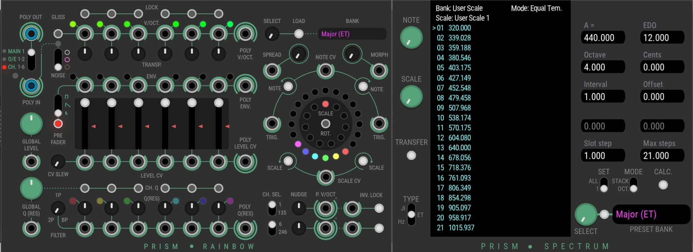

Prism is a plugin for the VCV virtual Eurorack environment.

* Rainbow a port of the 4ms SMR module to the VCV system.
* Spcetrum, an expander module for Rainbow. It creates User Scales for Rainbow.

The latest release is 1.2.0. It is available through the [Plugin Manager](https://vcvrack.com/plugins.html). You can contact us at amalgamatedharmonics@outlook.com. 

The manual for Rainbow and Spectrum can be found here: [Manual](https://github.com/AmalgamatedHarmonics/Prism/blob/master/doc/PrismUM.pdf)

Rainbow and Spectrum use source code from the 4ms Spectral Multiband Resonator firmware. This is licenced under the MIT license and available through GitHub.

The user interface was created by Pierre Collard - my enormous thanks to him for the fantastic work!

All graphical elements are copyright Pierre Collard licensed under the Creative Commons SA license.

