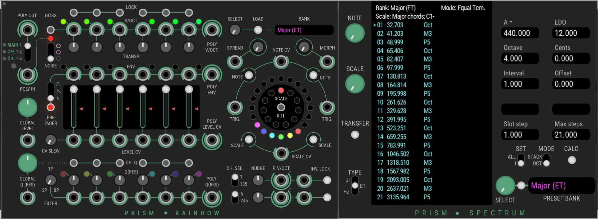

Prism is a plugin for the VCV virtual Eurorack environment.

* [Rainbow](https://github.com/AmalgamatedHarmonics/Prism/wiki/Rainbow), a port of the 4ms SMR module to the VCV system.

The latest release is 1.0.2. It is available through the [Plugin Manager](https://vcvrack.com/plugins.html). You can contact us at amalgamatedharmonics@outlook.com. 

